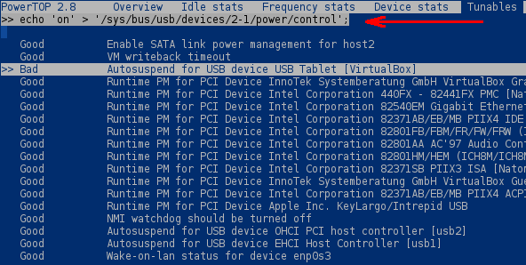
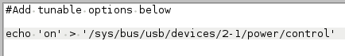

# Powertop Systemd auto-start Deployment Script
This script will allow Powertop to auto-start via Systemd. There's also a configuration file included where you can add custom tunable options for power control in which you may want Powertop auto-tune enabled or disabled for specific devices.

#### Requirements
Powertop

Systemd

## Setup
Enable the execute permission bit for the install script.

`chmod +x install`

Warning: The script will automatically enable Powertop with auto-tune settings after it completes the install. Powertop on auto-tune settings will disable some devices that might cause an undesirable result, so don't run this on a mission critical system.

Run the install script as a regular user. It will prompt for sudo privilege.

`./install`

####  Enable / Disable Tunables
If you have any custom tunable options that you want to set for devices, you can add them to the powertop.conf file located in /etc. You can execute custom tunable options by running `powertop_tunables` from the command line.

Note: A quick way to find the command to enable / disable Powertop's auto-tune control of a device, run Powertop and navigate to the "tunables" view. Return / Enter on the option that you want enabled / disabled and take note of the "echo" command printed at the top.

echo 'on' = Powertop Disabled for specified device

echo 'auto' = Powertop Enabled for specified device

Copy the echo command into the /etc/powertop.conf file as seen in the screen-shot below. You can add multiple lines.

## Removal
To uninstall the script, enable the execute permission bit for the removal script.

`chmod +x remove`

Run the removal script as a regular user. It will prompt for sudo privilege.

./remove

Reboot the system after it completes.

#### Credits
EMH-Mark-I 18/2017
